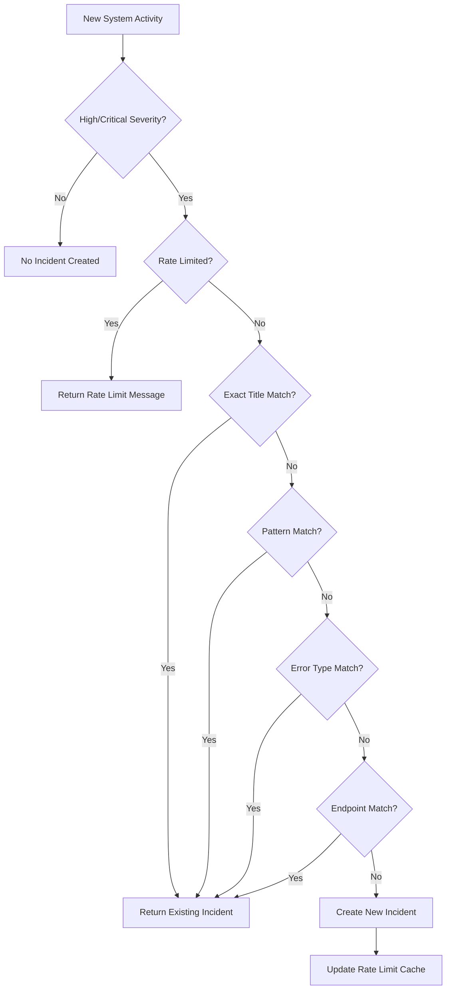

# Incident Duplicate Prevention System

This document explains how the incident management system prevents duplicate incidents from being created, ensuring clean and organized incident tracking.

## 🎯 Overview

The system implements multiple layers of duplicate prevention to avoid creating redundant incidents when the same or similar issues occur multiple times.

## 🛡️ Duplicate Prevention Layers

### **1. Rate Limiting**
- **Purpose**: Prevents rapid successive incident creation attempts
- **Implementation**: In-memory cache with 5-minute cooldown period
- **Key**: `source:title` combination
- **Behavior**: Blocks new incidents with same source and title within 5 minutes

```typescript
// Example: These would be rate limited
await SystemActivityLogger.logCriticalError('Database Down', '...', 'database');
await SystemActivityLogger.logCriticalError('Database Down', '...', 'database'); // Blocked for 5 minutes
```

### **2. Exact Title Matching**
- **Purpose**: Prevents identical incidents with same title
- **Time Window**: 1 hour
- **Status Check**: Only active incidents (investigating, identified, monitoring)
- **Behavior**: Returns existing incident if found

```typescript
// Example: These would be considered duplicates
await SystemActivityLogger.logCriticalError('Database Connection Lost', '...', 'database');
await SystemActivityLogger.logCriticalError('Database Connection Lost', '...', 'database'); // Duplicate
```

### **3. Pattern Matching**
- **Purpose**: Prevents similar incidents with dynamic error messages
- **Implementation**: Extracts key words from title and searches for patterns
- **Time Window**: 1 hour
- **Behavior**: Matches incidents with similar wording

```typescript
// Example: These would be considered duplicates
await SystemActivityLogger.logCriticalError('Database Connection Lost', '...', 'database');
await SystemActivityLogger.logCriticalError('Database Connection Failed', '...', 'database'); // Similar pattern
```

### **4. Error Type Matching**
- **Purpose**: Prevents incidents for same error types from same source
- **Time Window**: 1 day
- **Implementation**: Matches by error name in metadata
- **Behavior**: Groups similar error types together

```typescript
// Example: These would be considered duplicates
await SystemActivityLogger.logCriticalError('DB Error', 'MongoError occurred', 'database', { errorName: 'MongoError' });
await SystemActivityLogger.logCriticalError('DB Issue', 'Another MongoError', 'database', { errorName: 'MongoError' }); // Same error type
```

### **5. Endpoint/URL Matching**
- **Purpose**: Prevents incidents for same API endpoints
- **Time Window**: 1 hour
- **Implementation**: Matches by endpoint in metadata
- **Behavior**: Groups API errors by endpoint

```typescript
// Example: These would be considered duplicates
await SystemActivityLogger.logCriticalError('API Error', 'Error on /api/users', 'api', { endpoint: '/api/users' });
await SystemActivityLogger.logCriticalError('API Failure', 'Another error on /api/users', 'api', { endpoint: '/api/users' }); // Same endpoint
```

## 🔄 Incident Lifecycle and Duplicate Prevention

### **Active Incidents (Duplicates Prevented)**
- **Status**: `investigating`, `identified`, `monitoring`
- **Behavior**: New similar incidents are blocked
- **Response**: Returns existing incident with message "Similar incident already exists"

### **Resolved Incidents (Duplicates Allowed)**
- **Status**: `resolved`
- **Behavior**: New similar incidents are allowed
- **Use Case**: Same issue recurring after resolution

### **Time Windows**
- **1 Hour**: For exact matches and pattern matches
- **1 Day**: For error type matches
- **5 Minutes**: For rate limiting

## 📊 Duplicate Prevention Flow



## 🧪 Testing Duplicate Prevention

### **Test Script**
Run the test script to verify duplicate prevention:

```bash
cd backend && npm run ts-node src/scripts/testIncidentDuplicatePrevention.ts
```

### **Test Cases**
1. **Exact Duplicate**: Same title, same source
2. **Pattern Duplicate**: Similar title with different wording
3. **Error Type Duplicate**: Same error type from same source
4. **Endpoint Duplicate**: Same API endpoint errors
5. **Rate Limiting**: Rapid successive calls
6. **Severity Filtering**: Only high/critical create incidents
7. **Resolved Incident**: New incident allowed after resolution

## 📝 Logging and Monitoring

### **Duplicate Prevention Logs**
```typescript
// When duplicate is prevented
logger.info('Duplicate incident prevented', {
  existingIncidentId: 'inc_123',
  newTitle: 'Database Connection Lost',
  source: 'database'
});

// When rate limited
logger.info('Incident creation rate limited', {
  source: 'database',
  title: 'Database Connection Lost',
  timeSinceLastCreation: 120000
});
```

### **Success Logs**
```typescript
// When incident is created
logger.info('Incident created from critical error', {
  incidentId: 'inc_456',
  errorName: 'MongoError',
  endpoint: '/api/users'
});
```

## ⚙️ Configuration

### **Rate Limiting**
- **Cooldown Period**: 5 minutes (300,000ms)
- **Cache Cleanup**: 1 hour (3,600,000ms)

### **Time Windows**
- **Exact Match**: 1 hour
- **Pattern Match**: 1 hour  
- **Error Type Match**: 1 day
- **Endpoint Match**: 1 hour

### **Severity Thresholds**
- **Incident Creation**: High and Critical only
- **System Activity Logging**: All severities

## 🚨 Error Handling

### **Graceful Degradation**
- Duplicate prevention failures don't break incident creation
- Rate limiting failures don't break system activity logging
- Database errors are logged but don't crash the system

### **Fallback Behavior**
- If duplicate check fails, incident is still created
- If rate limiting fails, incident creation proceeds
- All errors are logged for monitoring

## 🔧 Customization

### **Adjusting Time Windows**
```typescript
// In checkForDuplicateIncident method
const oneHourAgo = new Date(now.getTime() - 60 * 60 * 1000); // Adjust as needed
const oneDayAgo = new Date(now.getTime() - 24 * 60 * 60 * 1000); // Adjust as needed
```

### **Adjusting Rate Limits**
```typescript
// In createIncidentFromSystemActivity method
if (lastCreation && (now - lastCreation) < 300000) { // Adjust 5 minutes as needed
```

### **Adding New Duplicate Checks**
```typescript
// Add new checks in checkForDuplicateIncident method
// Check 5: Custom business logic
if (systemActivity.metadata?.customField) {
  // Your custom duplicate detection logic
}
```

## 📈 Performance Considerations

### **Database Queries**
- Uses indexed fields for fast lookups
- Limits time windows to reduce query scope
- Uses regex only when necessary

### **Memory Usage**
- Rate limiting cache is cleaned up automatically
- Cache size is bounded by cleanup intervals
- No persistent memory leaks

### **Query Optimization**
- MongoDB indexes on: `title`, `status`, `createdAt`
- Compound indexes for complex queries
- Efficient regex patterns

## 🎯 Best Practices

### **For Developers**
1. **Use Descriptive Titles**: Help with pattern matching
2. **Include Metadata**: Provide context for duplicate detection
3. **Monitor Logs**: Watch for duplicate prevention messages
4. **Test Scenarios**: Verify duplicate prevention works as expected

### **For Operations**
1. **Monitor Incident Volume**: Watch for excessive duplicate prevention
2. **Review Patterns**: Identify recurring issues
3. **Adjust Thresholds**: Fine-tune time windows if needed
4. **Clean Up Resolved**: Archive old resolved incidents

## 🔍 Troubleshooting

### **Common Issues**

#### **Too Many Duplicates Prevented**
- **Cause**: Time windows too long
- **Solution**: Reduce time windows in `checkForDuplicateIncident`

#### **Not Enough Duplicates Prevented**
- **Cause**: Time windows too short or patterns too strict
- **Solution**: Increase time windows or adjust pattern matching

#### **Rate Limiting Too Aggressive**
- **Cause**: 5-minute cooldown too long
- **Solution**: Reduce cooldown period

#### **Performance Issues**
- **Cause**: Too many database queries
- **Solution**: Add database indexes or optimize queries

### **Debugging**
```typescript
// Enable debug logging
logger.debug('Duplicate check details', {
  title: systemActivity.title,
  source: systemActivity.source,
  metadata: systemActivity.metadata,
  timeWindows: { oneHourAgo, oneDayAgo }
});
```

This comprehensive duplicate prevention system ensures that your incident management remains clean, organized, and efficient while preventing noise from redundant incidents.
